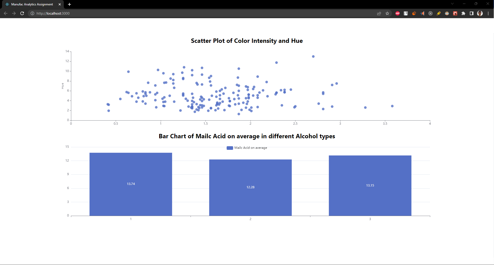
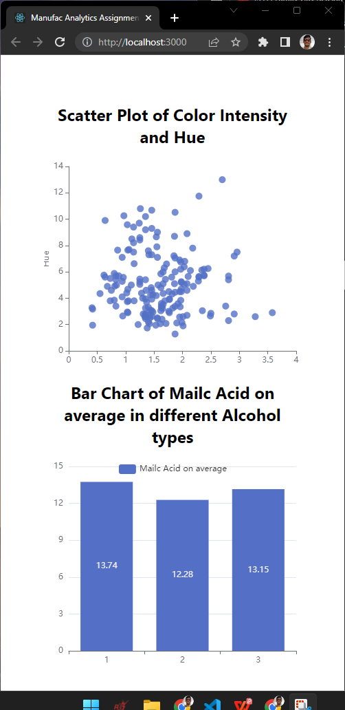

## Manufac Analytics Assignment

An simple react application which takes the data from json file and plot a scatter plot and a bar graph, built with React , JavaScript, and CSS.

## Assignment Status

This Assignment development is complete.

## Assignment Screen Shots

## Installation and Setup Instructions
Clone down this repository. 
You will need `node` and `yarn` installed globally on your machine.  

Installation:
`yarn`  

To Start Server:
`yarn start`  

To Visit App:
`localhost:3000`  

